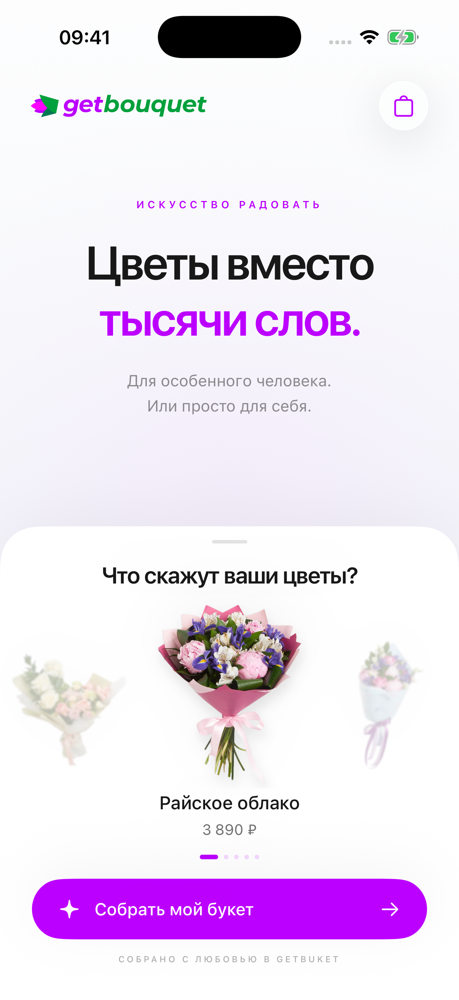
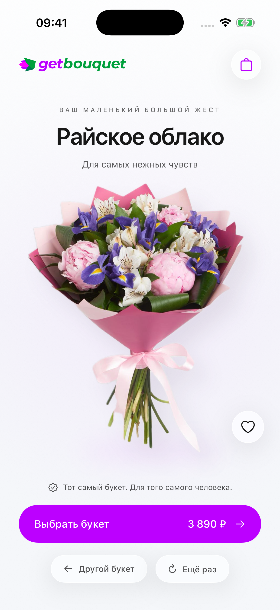

# GetBuket — выбор букета

Нативный прототип на SwiftUI для показа идеи приложения. Работает офлайн, фотографии включены в сборку. Сделан по видео с выбором напитков: нижняя карусель, объекты без фона, инерционное листание, уход панели вниз и переход к предметной сцене с анимацией сборки.

[Видео демонстрации, MP4](demo/GetBuket-demo.mp4)

<p>
  
  
</p>

## Запуск на другом Mac

Нужны **Xcode 26 или новее** и установленный **iOS Simulator**. Для полного эффекта Liquid Glass выберите iOS 26; минимальная версия запуска — iOS 18. Проверено на Xcode 26.6 / iOS 26.5, iPhone 17 Pro.

1. Скачайте репозиторий: **Code → Download ZIP**, распакуйте архив. Или клонируйте:

   ```sh
   git clone https://github.com/Mind3Scape/getbuket-ios-demo.git
   cd getbuket-ios-demo
   ```

2. Откройте **GetBuket.xcodeproj**.
3. Выберите схему **GetBuket**, а рядом — любой доступный **iPhone Simulator** (например, iPhone 17 Pro).
4. Нажмите **⌘R** и дождитесь запуска.

Подпись, платная учётная запись разработчика, ключи API, сервер, CocoaPods, XcodeGen и установка Python-пакетов для запуска не нужны. В проект включены готовые ресурсы и общая схема Xcode. Исходные фото повторно обрабатывать не требуется.

Альтернатива — дважды нажмите **Запустить.command** или выполните из папки проекта:

```sh
bash scripts/run.sh
```

Скрипт сам найдёт подходящий iPhone Simulator на вашем Mac, соберёт приложение и запустит его. Сначала выбирается уже запущенный iPhone; иначе — iPhone на самой новой доступной iOS. Привязки к компьютеру автора нет.

Если симуляторов нет, загрузите iOS в **Xcode → Settings → Components**, затем создайте iPhone в **Window → Devices and Simulators**. Если в терминале выбран только Command Line Tools, выберите установленный Xcode в **Xcode → Settings → Locations → Command Line Tools**. Двойной клик по скачанному `.command` macOS иногда ограничивает — в этом случае используйте запуск из Xcode или команду `bash scripts/run.sh`.

## Как показать

1. Листайте букеты в белой панели мышью: зажмите и проведите влево или вправо. Можно нажимать соседние букеты.
2. Нажмите **Собрать мой букет** — панель уйдёт вниз, цветы соберутся в центральной сцене.
3. **Ещё раз** повторяет анимацию. **Другой букет** возвращает карусель.
4. **Выбрать букет** добавляет его в локальную корзину. Сердечко отмечает избранное в текущем сеансе.
5. Для автоматического показа удерживайте логотип и выберите **Запустить демонстрацию**. Либо выполните `bash scripts/run.sh --record-demo`.

Корзина служит показу сценария: заказы не отправляются, оплаты и подключения к магазину нет. Состояние корзины и избранного хранится в памяти до закрытия приложения.

## Запись экрана

В Simulator используйте **File → Record Screen** или команду:

```sh
xcrun simctl io booted recordVideo --codec=h264 getbuket-demo.mp4
```

После показа нажмите **Ctrl+C** в терминале, чтобы завершить запись. В каталоге `demo` лежит готовый ролик, записанный с симулятора.

## Цвета

Фирменный фиолетовый `#BC00FF`, зелёный `#007852`, светлая поверхность `#F5F7FA` и текст `#181818` взяты из CSS магазина. Основной акцент интерфейса — фиолетовый, логотип сохранён без изменений.

## Материалы

- Референс: https://x.com/BreejeAnadkat/status/2092558611704951224
- Фотографии, названия, цены и логотип: https://www.гетбукет.рф (21 сентября 2026).
- Пять букетов: Райское облако, Рената, Летняя поляна, Летний луг, Подготовка к свиданию.
- `assets/catalog.json` содержит прямые ссылки на исходные фотографии. Исходники сохранены в `assets/originals`, прозрачные изображения — в `assets/cutouts`.
- Фон удалён локально через [Apple Vision](https://developer.apple.com/documentation/vision/vngenerateforegroundinstancemaskrequest). Скрипт — `scripts/remove-background.swift`.
- Светлый минималистичный фон и анимации созданы кодом SwiftUI. До появления цветов в верхней части экрана остаётся только текст. Кнопки корзины, избранного и повтора используют системный Liquid Glass на iOS 26 (на старых версиях — material). Букеты — реальные фото магазина. Слоганы и сценарий анимации — концепция прототипа.

## Файлы проекта

- `GetBuket/BouquetExperience.swift` — карусель, состояния анимации, локальная корзина.
- `GetBuket/StudioScene.swift` — минималистичный фон, Liquid Glass и частицы цветов.
- `GetBuket/Bouquet.swift` — данные каталога.
- `project.yml` — конфигурация XcodeGen. Готовый `.xcodeproj` включён; XcodeGen не требуется для обычного запуска.

Повторная подготовка ресурсов: `python3 scripts/prepare-assets.py` (Pillow; также нужен предварительно растеризованный `assets/logo.png`). Для новых фото: `swift scripts/remove-background.swift assets/originals/2204.jpg`.
